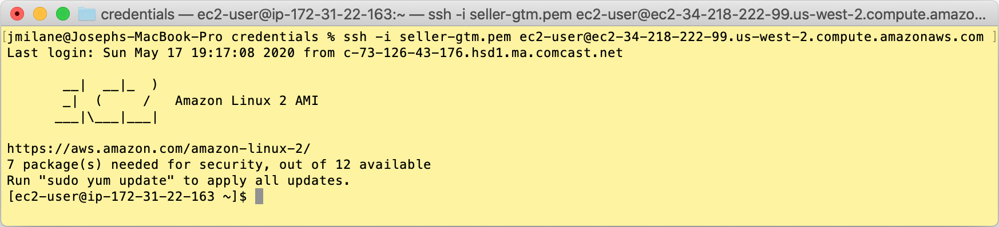
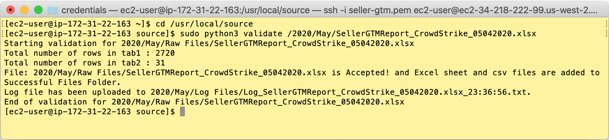
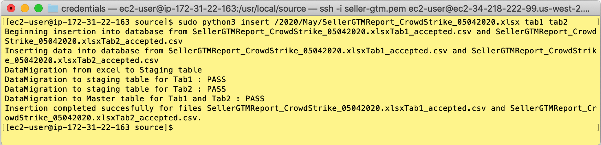

# source

__source__ is a Python project.  It contains two Python scripts that are invoked from the command line: __validate__ and __insert__.  They both deal with lead and campaign data. 

* __validate__ performs business rule validation checking on an Excel file containing the lead and campaign data. If the validation passes, the __validate__ job prepares two CSV files for ingestion into Redshift, one for leads and one for campaighs, and uploads those files to S3.  
* __insert__ loads the raw CSV data into separate staging tables for both leads and campaigns, then performs some additional transformations in SQL to load the data into the ultimate destination tables for leads and campaigns, __us\_gtmsales.mst_sellerleads__ and __us\_gtmsales.mst_sellercampaigns__.

There are additional Redshift custom stored procedures that are executed by both the validate and insert scripts.

This repo is currently deployed to the __seller-gtm__ EC2 Linux instance in the Audienz AWS environment.  The deployment path is __/usr/local/source__.


## how to run
### connect to EC2
You'll need the pem file to connect to the EC2 instance, and your IP address will need to be configured to reach the EC2 instance via SSH in the inbound rules of the instance's security group.  The following command connects to the instance:

	ssh -i seller-gtm.pem ec2-user@ec2-34-218-222-99.us-west-2.compute.amazonaws.com

Here is an example of connecting from an OSX terminal:


### validate
To run __validate__, the source Excel file must be placed in the S3 bucket specified in the __bucket__ parameter in the __config.ini__ file (set to __gtm-seller__ in production and __gtm-seller-sandbox__ in test), and in a path that follows the format of:
	```
	{Year}/{Month}/Raw Files
	```
	
The __validate__ command takes one argument with the format of:
	```
	/{Year}/{Month}/<File Name>
	```

For example, to navigate to the directory containing this repo on EC2 and validate a file named __SellerGTMReport\_CrowdStrike_05042020.xlsx__ located in __s3://2020/May/Raw Files/SellerGTMReport\_CrowdStrike_05042020.xlsx__, please first navigate to the __/usr/local/source__ directory, issue the following commands:
	```
	sudo python3 validate /2020/May/SellerGTMReport_CrowdStrike_05042020.xlsx
	```

Output should print to the terminal indicating the success or failure of the validation run. An example of running the command above is displayed in the following image:


### insert
Once validate runs successfully, two files with the format of __{File Name}Tab1_accepted.csv__ and __{File Name}Tab2_accepted.csv__ are uploaded to the __{Year}/{Month}/Successful Files__ path in the S3 bucket (a copy of the original file is also placed in this path and has a ___SUCCESS.xlsx__ suffix appended to the name, but that file is not used).

To insert the data from these files into Redshift, the __insert__ command takes one argument with the format of:
	```
	/{Year}/{Month}/<File Name> tab1 tab2
	```

For example, to insert the results of the successful validate run for __SellerGTMReport\_CrowdStrike_05042020.xlsx__ from above, issue the following command:
	```
	insert /2020/May/SellerGTMReport_CrowdStrike_05042020.xlsx tab1 tab2
	```

Output should print to the terminal indicating the success or failure of the insertion run. An example of running the command above is displayed in the following image:


## Configuration of Redshift and S3: the config.ini file

The __config.ini__ file is contains system parameters that are used by the __validate__ and __insert__ jobs.  It allows for easy toggling between S3 buckets and Redshift instances.  It has been used for switching between the test and production S3 bucket and Redshift instance.  The current EC2 deployment is configured to use the production.  Currently, only the Redshift __host__ and S3 __bucket__ differ between the test and production environments; to toggle simply comment and uncomment the appropriate variables with a __;__ sign.

The Redshift parameters are:

* dbname
* host
* port
* user
* password

The S3 parameters are:

* bucket
* access\_key_id
* secret\_access_key

## git repository access
This __source__ git repository hosted in the Bitbucket source control platform was deployed to __/usr/local/source__ with a Bitbucket user who is no longer active on the project.  In order to deploy any changes from the repository, the origin url of the repository will need to be reset with the current Bitbucket user's username, i.e.:
	```
	git remote set-url origin <url-with-current-username>
	```

Please visit [this Stack Overflow post](https://stackoverflow.com/questions/15166722/use-own-username-password-with-git-and-bitbucket) for more details on using different credentials for a repository.